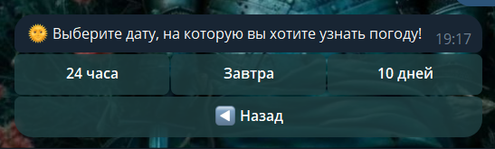
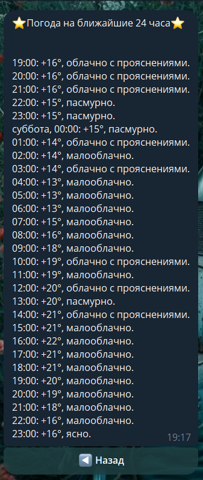
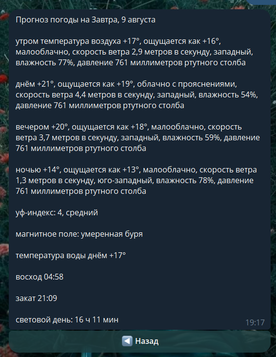
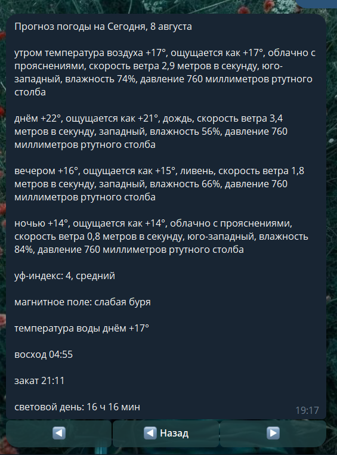

# WEATHERBOT
## Описание
Weatherbot - ТГ-бот, который предоставляет прогноз погоды с сайта Яндекс.Погоды.
## Возможности
* Погода на ближайшие 24 часа
* Подробный прогноз погоды на сегодня
* Подробный прогноз погоды на ближайшие 10 дней
* Переход по ссылке на сайт Яндекс.Погоды
## Используемые технологии
* PyTelegramBotApi
* Selenium
* BeautifulSoup
## Скриншоты
* Выбор даты

* Прогноз на ближайшие сутки

* Подробный прогноз на завтра

* Прогноз на 10 дней

